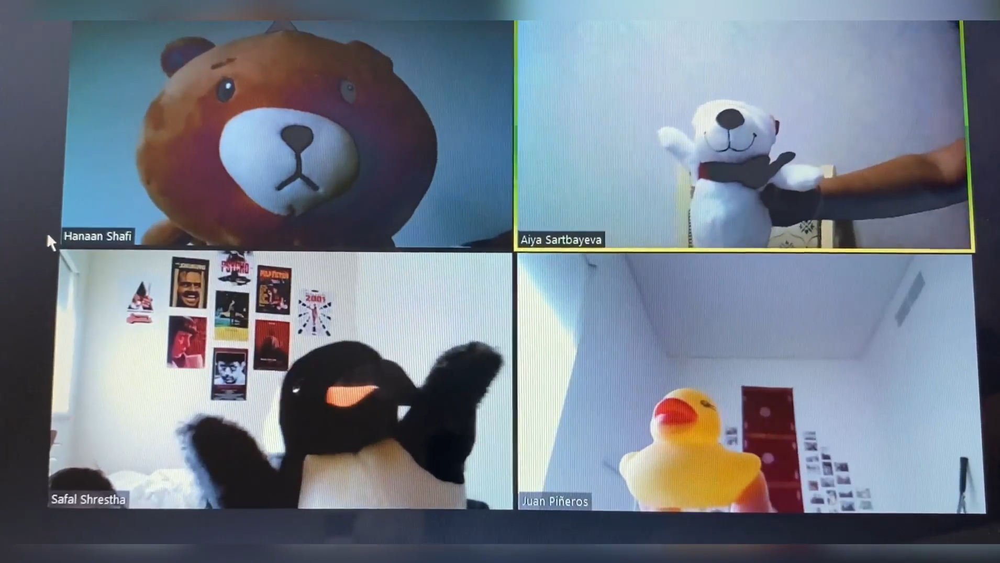

# Our Daily Routine

This is a website that me and my teammates created for the Communications Lab, Summer 2021 class.  
We had to come up with a concept, shoot the video, and edit it in 30 minutes during class time.  
This website was created to present this video in an artistic way.

I had a specific aesthetic in my mind while creating this website. Since the concept is pretty fictional, I wanted to stick to that. As we used our plushies and toys for the video,
I wanted to give the warm and cute vibe of the video through the website. Therefore, I kept that in mind while selecting my font and colors. Overall, the style is pretty
handwritten and doodly. I used cute gifs to make the website feel more dynamic. Also, I put some effort into making sure that the website looks good on mobile.
